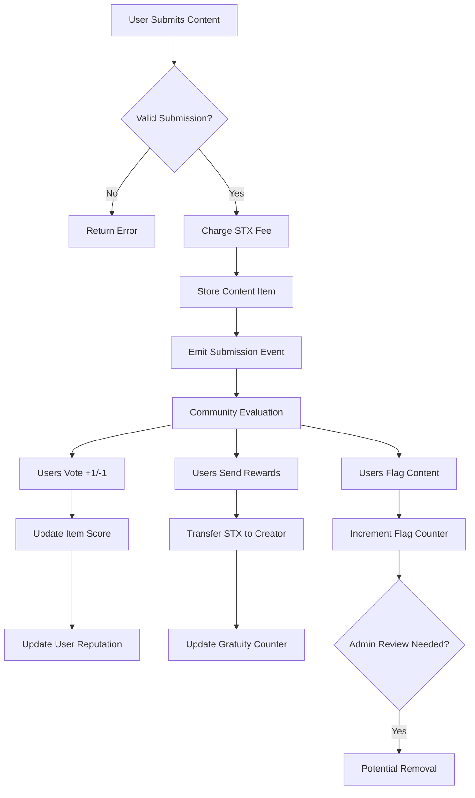
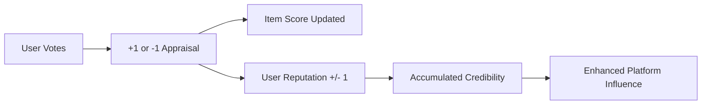

# BitCurator Protocol

> Decentralized Content Curation & Reputation System on Bitcoin via Stacks

BitCurator is a community-driven content discovery platform that leverages collective intelligence to curate, rank, and reward high-quality content. Built on Stacks blockchain for Bitcoin security, it creates sustainable incentive mechanisms where quality content rises through transparent community evaluation.

## 🚀 Key Features

- **Decentralized Curation**: Community-driven content submission and evaluation
- **Reputation System**: Transparent scoring based on participation quality
- **Creator Monetization**: Direct STX rewards from community to creators
- **Multi-Category Organization**: Structured content across diverse topics
- **Community Moderation**: Distributed flagging and quality control
- **Bitcoin Security**: Leverages Bitcoin's security through Stacks Layer 2

## 📋 Table of Contents

- [System Overview](-#system-overview)
- [Contract Architecture](-#contract-architecture)
- [Data Flow](-#data-flow)
- [Installation](-#installation)
- [Usage](-#usage)
- [API Reference](-#api-reference)
- [Contributing](-#contributing)


## 🏗️ System Overview

BitCurator operates as a decentralized autonomous organization (DAO) for content curation, implementing a multi-layered architecture that ensures quality, transparency, and sustainable incentives.

### Core Components

```
┌─────────────────┐    ┌──────────────────┐    ┌─────────────────┐
│   Content       │    │   Community      │    │   Reputation    │
│   Submission    │◄──►│   Evaluation     │◄──►│   System        │
│                 │    │                  │    │                 │
└─────────────────┘    └──────────────────┘    └─────────────────┘
         │                       │                       │
         ▼                       ▼                       ▼
┌─────────────────┐    ┌──────────────────┐    ┌─────────────────┐
│   STX Payments  │    │   Quality        │    │   Governance    │
│   & Rewards     │    │   Filtering      │    │   & Moderation  │
└─────────────────┘    └──────────────────┘    └─────────────────┘
```

### Stakeholder Ecosystem

- **Content Creators**: Submit valuable content, earn STX rewards
- **Community Curators**: Evaluate content quality, build reputation  
- **Platform Users**: Discover high-quality content, support creators
- **Protocol Administrators**: Maintain system integrity, manage categories

## 🏛️ Contract Architecture

### Data Storage Layer

```
curated-items (Map)
├── item-identifier: uint
└── {
    originator: principal,
    headline: string-ascii(100),
    hyperlink: string-ascii(200),
    topic: string-ascii(20),
    publication-epoch: uint,
    appraisals: int,
    gratuities: uint,
    flags: uint
}

participant-appraisals (Map)
├── {participant: principal, item-identifier: uint}
└── {appraisal: int}

participant-credibility (Map)
├── participant: principal
└── {metric: int}
```

### Function Categories

#### **Public Functions**

- `contribute-item`: Content submission with fee payment
- `appraise-item`: Community voting mechanism
- `reward-originator`: Direct creator monetization
- `flag-item`: Content moderation system

#### **Read-Only Functions**

- `retrieve-item-details`: Content metadata queries
- `retrieve-top-items`: Quality-filtered content discovery
- `retrieve-participant-credibility`: Reputation queries

#### **Administrative Functions**

- `adjust-submission-charge`: Fee management
- `expunge-item`: Emergency content removal
- `introduce-topic`: Category expansion

## 🔄 Data Flow

### Content Lifecycle



### Reputation Flow



### Economic Model

```
Content Submission → STX Fee → Protocol Treasury
Community Rewards → STX Transfer → Creator Wallet  
Quality Content → Higher Visibility → More Rewards
```

## 🛠️ Installation

### Prerequisites

- [Clarinet](https://github.com/hirosystems/clarinet) installed
- Stacks wallet for testnet/mainnet deployment
- Node.js 16+ for frontend integration

### Local Development

```bash
# Clone repository
git clone https://github.com/piro-james/bit-curator.git
cd bit-curator

# Initialize Clarinet
clarinet new bitcurator
cd bitcurator

# Add contract
clarinet contract new bitcurator

# Run tests
clarinet test

# Deploy to testnet
clarinet deploy --testnet
```

## 📖 Usage

### Submit Content

```javascript
// Submit new content item
const result = await callPublicFunction({
  contractAddress: 'SP123...ABC',
  contractName: 'bitcurator',
  functionName: 'contribute-item',
  functionArgs: [
    stringAsciiCV('Revolutionary DeFi Protocol Launch'),
    stringAsciiCV('https://example.com/defi-protocol-analysis'),
    stringAsciiCV('Technology')
  ]
});
```

### Vote on Content

```javascript
// Upvote content item
const vote = await callPublicFunction({
  contractAddress: 'SP123...ABC', 
  contractName: 'bitcurator',
  functionName: 'appraise-item',
  functionArgs: [
    uintCV(1), // item ID
    intCV(1)   // +1 vote
  ]
});
```

### Reward Creator

```javascript
// Send STX reward to content creator
const reward = await callPublicFunction({
  contractAddress: 'SP123...ABC',
  contractName: 'bitcurator', 
  functionName: 'reward-originator',
  functionArgs: [
    uintCV(1),        // item ID
    uintCV(1000000)   // 1 STX in microSTX
  ]
});
```

## 📚 API Reference

### Public Functions

#### `contribute-item(headline, hyperlink, topic)`

Submit new content for community curation.

**Parameters:**

- `headline`: Content title (1-100 chars)
- `hyperlink`: Content URL (min 10 chars)  
- `topic`: Category from approved list

**Returns:** `(ok item-id)` or error

#### `appraise-item(item-identifier, appraisal)`

Vote on content quality with reputation impact.

**Parameters:**

- `item-identifier`: Target content ID
- `appraisal`: Vote value (1 or -1)

**Returns:** `(ok true)` or error

#### `reward-originator(item-identifier, gratuity-amount)`

Send STX rewards directly to content creators.

**Parameters:**

- `item-identifier`: Target content ID
- `gratuity-amount`: STX amount in microSTX

**Returns:** `(ok true)` or error

### Read-Only Functions

#### `retrieve-top-items(limit)`

Get highest-quality content items.

**Parameters:**

- `limit`: Maximum items to return

**Returns:** List of content items with positive scores

#### `retrieve-participant-credibility(participant)`

Get user's reputation score.

**Parameters:**

- `participant`: User principal

**Returns:** `{metric: int}` credibility data

## 🔒 Security Considerations

- **Reentrancy Protection**: State updates before external calls
- **Overflow Prevention**: Mathematical operation validation
- **Access Control**: Administrative function restrictions
- **Input Validation**: Comprehensive parameter checking
- **Economic Security**: Fee mechanisms prevent spam

## 🤝 Contributing

We welcome contributions to BitCurator Protocol! Please see our [Contributing Guidelines](CONTRIBUTING.md) for details.

### Development Workflow

1. Fork the repository
2. Create feature branch (`git checkout -b feature/amazing-feature`)
3. Write tests for new functionality
4. Ensure all tests pass (`clarinet test`)
5. Commit changes (`git commit -m 'Add amazing feature'`)
6. Push to branch (`git push origin feature/amazing-feature`)
7. Open Pull Request
